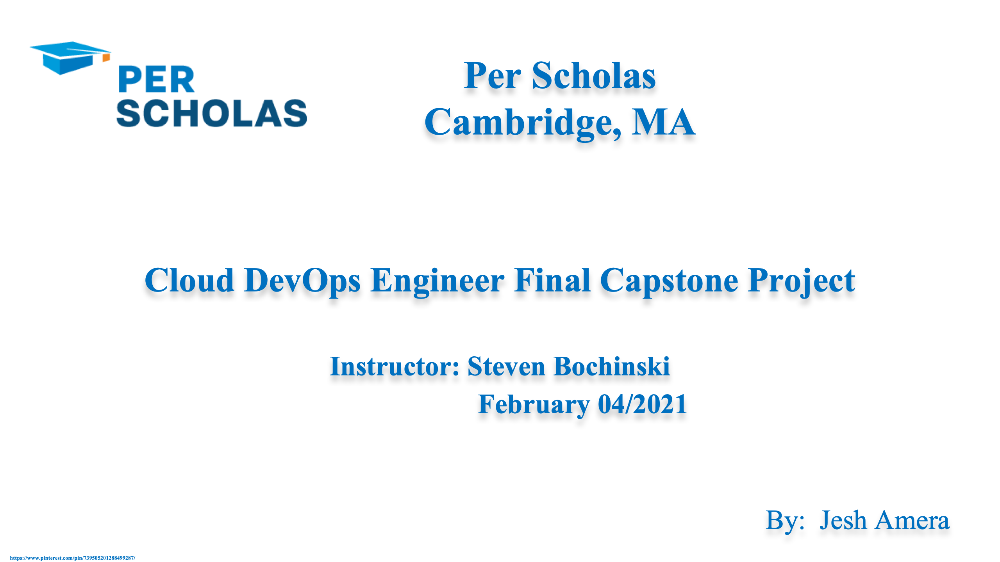
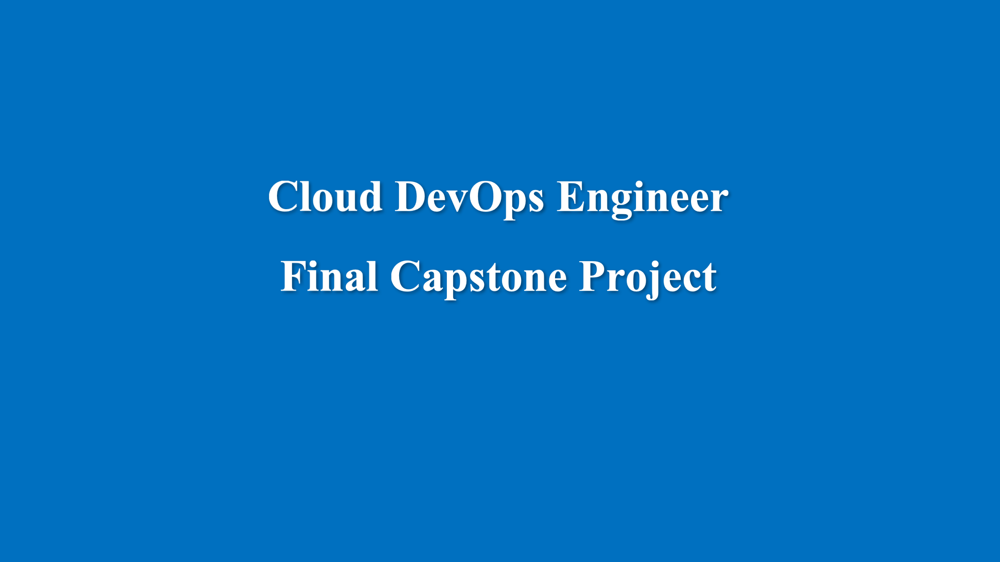


## [Instruction](https://docs.google.com/document/d/17OwlITE-yPWNj3Vi5RtQfz3ItvSkOfnbaVMnzlZyGTg)

## Step 1. Setup and Configure Linux Virtual Machine
* First download and install the free [VirtualBox](https://www.virtualbox.org/) software.
* Seconed downloade and configure an open source operating system [Ubuntu](https://ubuntu.com/download/desktop/thank-you?version=20.04.1&architecture=amd64/) OS.

	####  Ubuntu 20.04 VM configration and installation
	 * Go to Settings and configure **General**, **System**, **Display**, **Network**, and **Shared Folders** accourding to the following screenshot
```
Click New
```
	
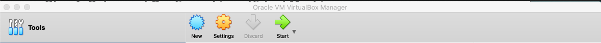
	
```
Give a name you like and choose 
Type: Linux
Version: Ubuntu(64-bit)
```
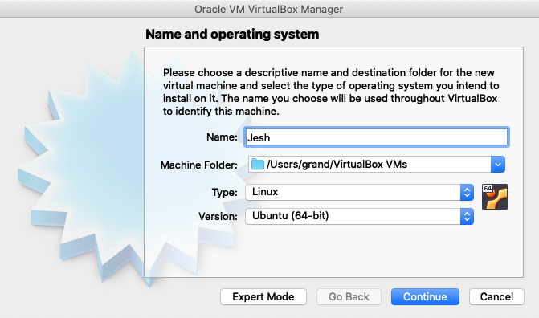
	 
```
Set the RAM 4GB or more - based on your system spec 
```
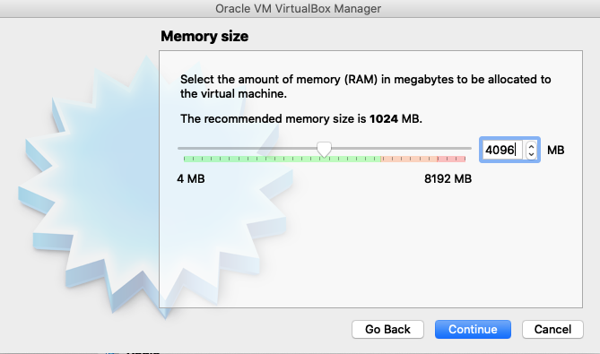
	 
```
Choose existing virtual hard disk file and create
```
	 
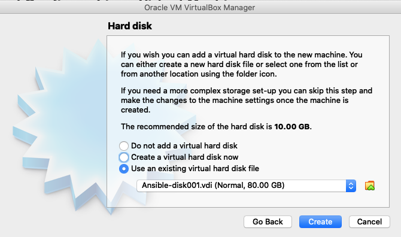
	 
```
Go to the Settings
```
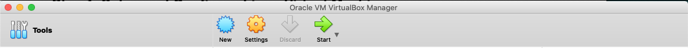
	 
```
General
Advanced Tab:
Shared Clipboard: Bidirectional
Drag'n'Drop: Bidirectional			
```
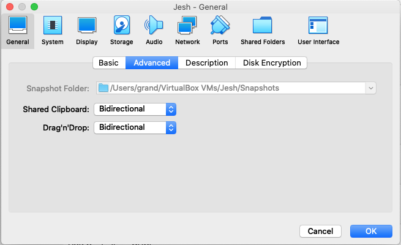
	  
```
Motherboard Tab:
Base Memory: 2GB
Extended Feature:  Enable I/O APIC
Processor Tab:
Processors(s): 2 CPU
Extended Features:
Enable PAE/Nx
Acceleration Tab:
Hardware Virtualization:
Enable VT-x/AMD-V
Enable Nested Paging
```
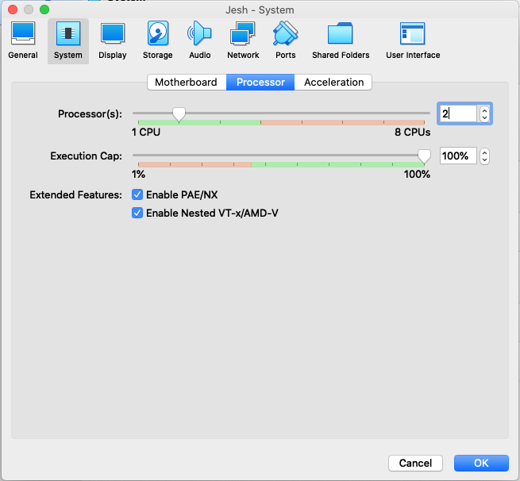
	
```
Display:
Screen Tab:
Video Memory: 28 MB
Graphic Controller: VMSVGA
Acceleration: Enable 3D Acceleration	 
```
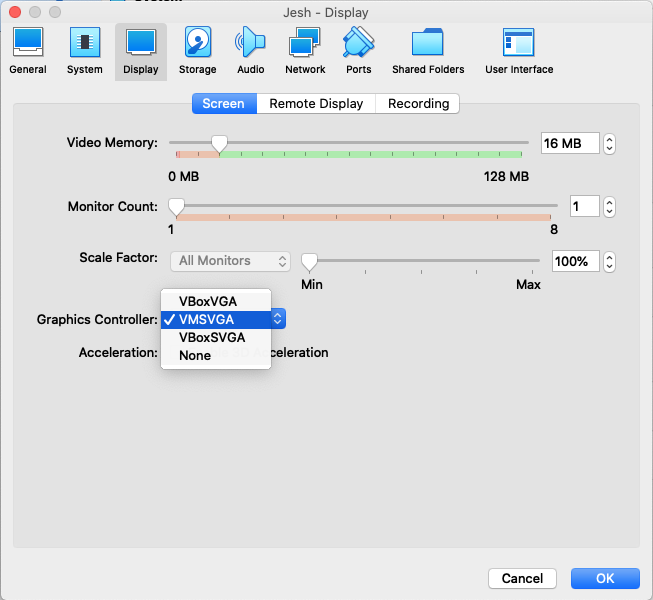
	 
```
Network:
Adapter 1:
Attached to: NAT Network
Advanced:
romiscuous Mode: Allow All
MAC Address: (click generate new MAC)
```
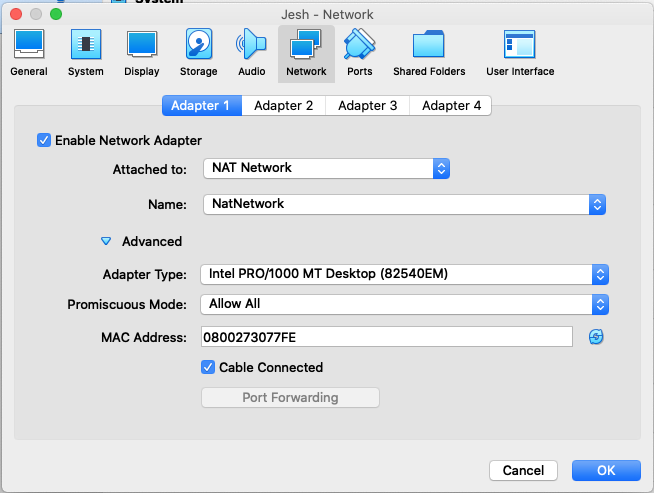
	 
```
Shared Folders 
```
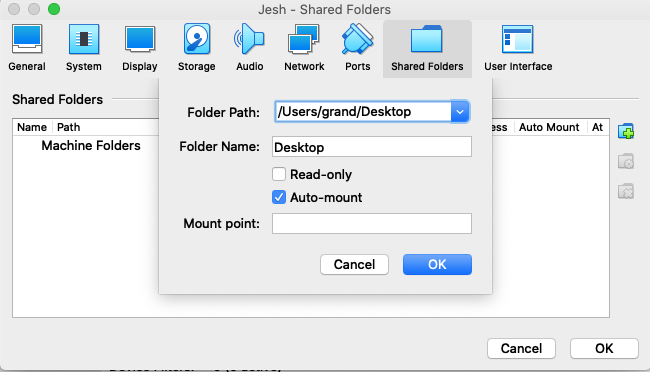
	 
```
Wallah! Click start to fire your VM	
```
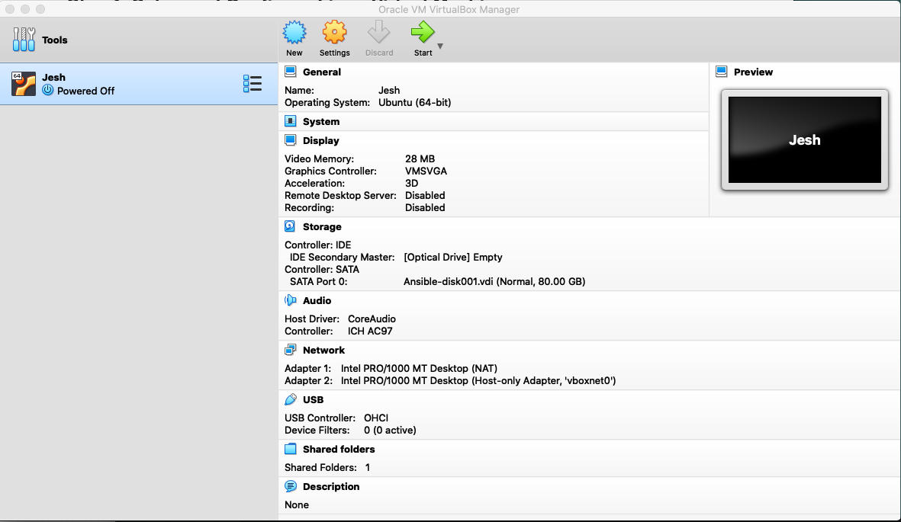
	 
```
Last thing to enable drag and drop, copy and paste, and to share folder betweeen the guest and host
macine run the following comands in your terminal once the vm starts.
```
`sudo add-apt-repository multiverse`


	 
`sudo apt install virtualbox-guest-dkms virtualbox-guest-x11`
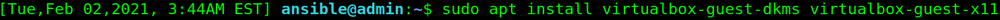
	
> Reboot the VM and enter the following
	 
`lsmod | grep vbox`

    
`mkdir -p ~/Share`
 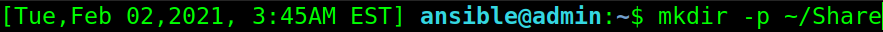
 
 `sudo mount -t vboxsf "your Shared folder name" ~/Share`
 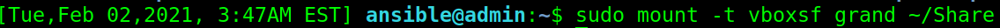
 	  
## Step 2. Designe, plan, and overview of the project


   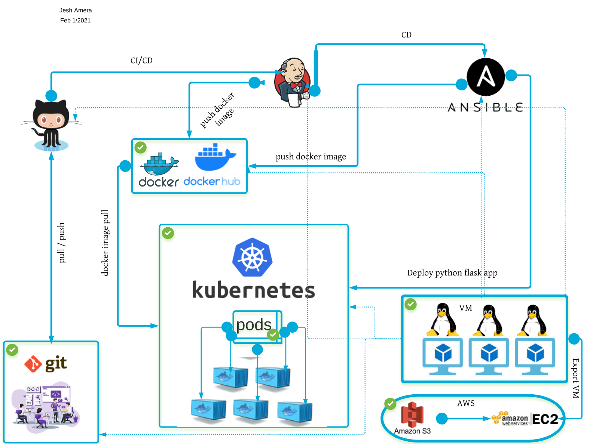


 	  
## Step 3. Install, run, and configure some DevOps tools
* VirtualBox
* Linux VM(Ubuntu 20.04)
* Python Flask App
* Git, GitHub
* Webhook
* Jenkins
* Docker
* Docker Hub
* Kubernetes
* Minikube
* Red Hat Ansible
* AWS Cloud Formation
* Ansible Tower
* AWS(S3,EC2)


> Install git for Debian/Ubuntu

```
$ sudo apt install git-all
$ git --version

```
> Install Python3 for Debian/Ubuntu

```
$ sudo apt-get update
$ sudo apt-get install python3
$ python3 --version
	- - -
$ sudo apt update
$ sudo apt install python3-pip
$ pip3 --version

```

> Install Jenkins for Debian/Ubuntu

```
$ wget -q -O - https://pkg.jenkins.io/debian-stable/jenkins.io.key | sudo apt-key add -
sudo sh -c 'echo deb https://pkg.jenkins.io/debian-stable binary/ > \
    /etc/apt/sources.list.d/jenkins.list'
$ sudo apt-get update
$ sudo apt-get install jenkins
$ sudo systemctl start jenkins
$ sudo systemctl status jenkins

```
> Install Java for Debian/Ubuntu

```
$ sudo apt update
$ sudo apt search openjdk
$ sudo apt install openjdk-11-jdk
$ sudo systemctl status jenkins
$ java -version

```
> Install Docker Desktop/Dockercli for Debian/Ubuntu

```
$ sudo apt update
$ sudo apt install apt-transport-https ca-certificates curl gnupg-agent software-properties-common
$ curl -fsSL https://download.docker.com/linux/ubuntu/gpg | sudo apt-key add -
$ sudo add-apt-repository "deb [arch=amd64] https://download.docker.com/linux/ubuntu 
$(lsb_release -cs) stable"
$ sudo apt update
$ sudo apt install docker-ce docker-ce-cli containerd.io

```
> Install kubclt/minikube for Debian/Ubuntu

```
$ curl -LO "https://dl.k8s.io/release/$(curl -L -s https://dl.k8s.io/release/stable.txt)
/bin/linux/amd64/kubectl"
$ sucurl -LO https://dl.k8s.io/release/v1.20.0/bin/linux/amd64/kubectl
$ curl -LO "https://dl.k8s.io/$(curl -L -s https://dl.k8s.io/release/stable.txt)/bin
/linux/amd64/kubectl.sha256"
$ echo "$(<kubectl.sha256) kubectl" | sha256sum --check
$ sudo install -o root -g root -m 0755 kubectl /usr/local/bin/kubectl
$ sudo apt-get update && sudo apt-get install -y apt-transport-https gnupg2 curl
$ curl -s https://packages.cloud.google.com/apt/doc/apt-key.gpg | sudo apt-key add -
$ echo "deb https://apt.kubernetes.io/ kubernetes-xenial main" | sudo tee -a /etc/apt
/sources.list.d/kubernetes.list
$ sudo apt-get update
$ sudo apt-get install -y kubectl
$ snap install kubectl --classic
$ kubectl version --client

$ sudo apt-get install curl
$ sudo apt-get install apt-transport-https
$ wget https://storage.googleapis.com/minikube/releases/latest/minikube-linux-amd64
$ sudo cp minikube-linux-amd64 /usr/local/bin/minikube
$ sudo chmod 755 /usr/local/bin/minikube
$ minikube version
$ minikube start


```
> Install Dockercompose for Debian/Ubuntu

```
$ sudo curl -L "https://github.com/docker/compose/releases/download/1.28.2/
docker-compose-$(uname -s)-$(uname -m)" -o /usr/local/bin/docker-compose
$ sudo chmod +x /usr/local/bin/docker-compose
$ sudo ln -s /usr/local/bin/docker-compose /usr/bin/docker-compose
$ docker-compose --version
docker-compose version 1.28.2, build 1110ad01
$ docker-compose migrate-to-labels


```

> Install Ansible/Ansible AWX for Debian/Ubuntu

```
$ sudo apt update
$ sudo apt install software-properties-common
$ sudo apt-add-repository --yes --update ppa:ansible/ansible
$ sudo apt install ansible
$ ansible -version

```
> Install ASKCLI/AWSCLI AWX for Debian/Ubuntu

```
$ sudo apt update
$ sudo apt-get install awscli
$ aws --version
$ pip install awscli --upgrade --user
$ python -m awscli --version
$ aws configure
$ python -m awscli configure

``` 

## Step 4. Testing, Building, Staging, and Production 

### Part 1. Create CI/CD pipelines using Jenkins
   [Jenkinsfile](https://github.com/simulationpoint/Cloud-DevOps-Engineer-Capstone-Project/blob/master/Jenkinsfile)
   
   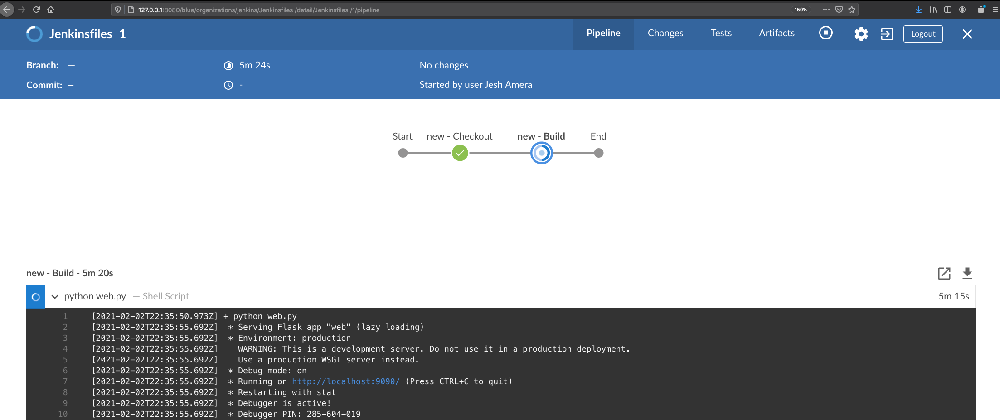
   
   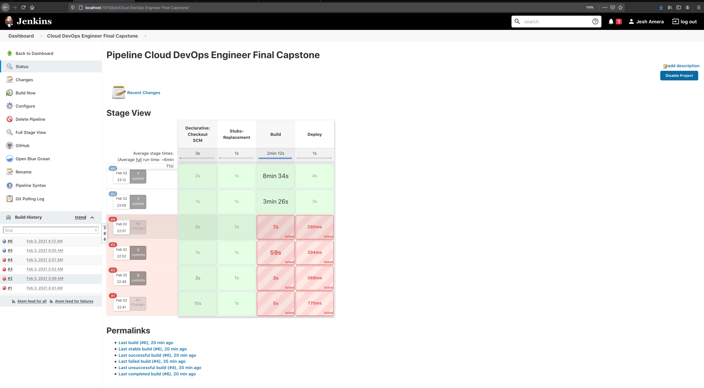
   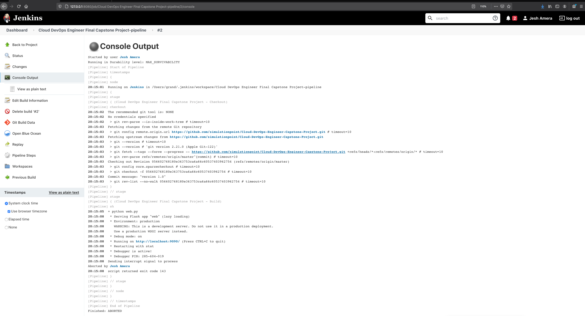
   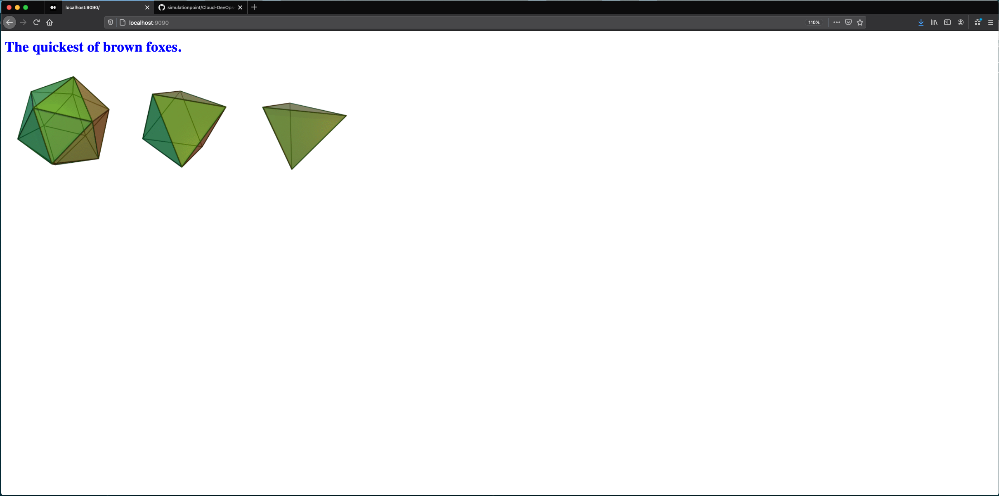

   
### Part 2. Dockerize Jenkins Pipeline
[Dockerfile](https://github.com/simulationpoint/Cloud-DevOps-Engineer-Capstone-Project/blob/master/Dockerfile)

   
### Part 3. Create Kubernetes Cluster 
[kubernetes.yaml ](https://github.com/simulationpoint/Cloud-DevOps-Engineer-Capstone-Project/blob/master/kubernetes.yaml)
 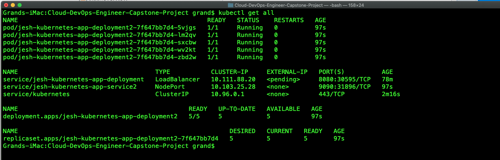  
 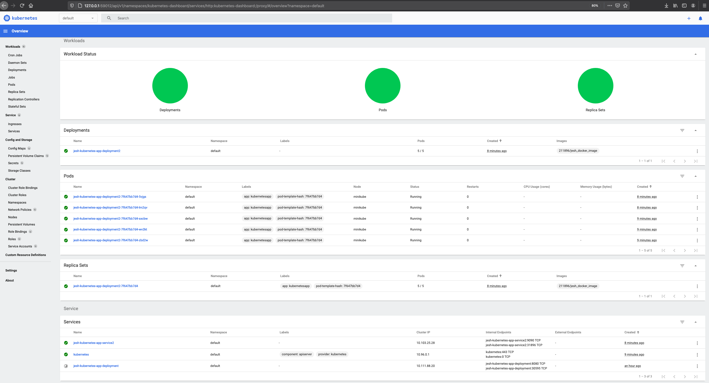   
   
### Part 4. Deploying dockerized web app using Ansible as a configuration management tool  
[ansible-playbook.yaml](https://github.com/simulationpoint/Cloud-DevOps-Engineer-Capstone-Project/blob/master/kubernetes.yaml)
   
## Step 4. Cloud implementation in AWS
### Part 1.
* Import prebuilt VM to AWS S3 bucket

### Part 2.

* Create an EC2 instance of the VM and launch the service


## Summary
* The most challenging part was ansible configuration,I have installed it natively to my local machine. Also not having enough time to study the materail and put it togethr.The way I have prepared, and the project requirment are diffrent.
   


   	   
